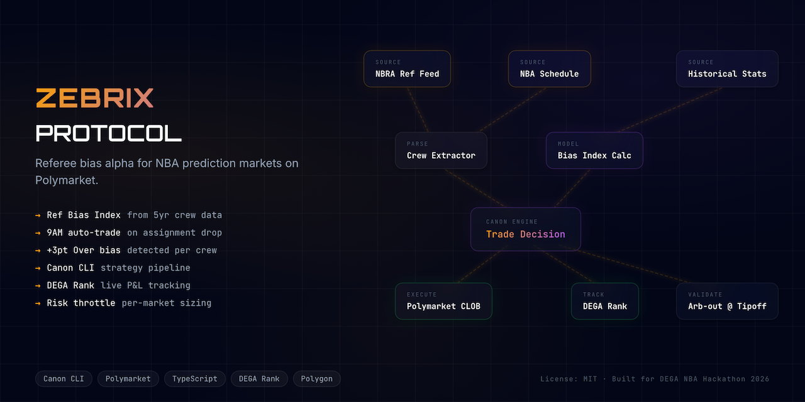
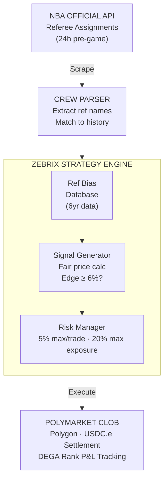
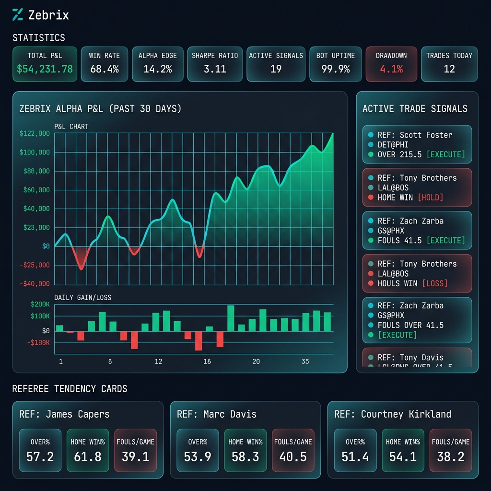
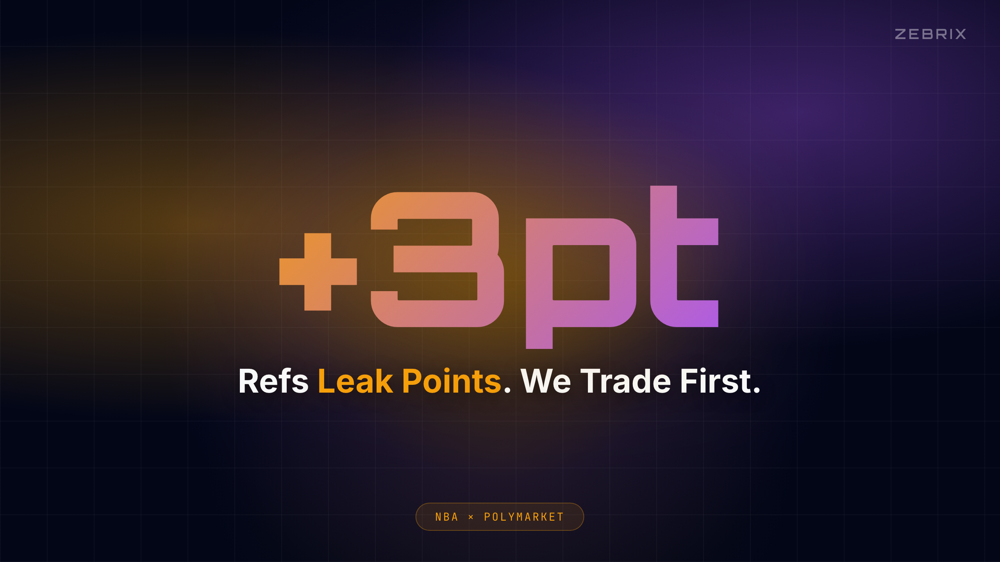

<div align="center">
  <h1>
    Zebrix 🏀
  </h1>
  <p><strong>Automated NBA referee-assignment alpha trader for Polymarket</strong><br/>
  <em>"Refs leak points. We trade first."</em></p>
  

  <br/>

  [](https://zebrix.edycu.dev)
  [](https://zebrix.edycu.dev/pitch)
  [](https://youtu.be/OkuA9sHAOOs)
  [](https://dorahacks.io/hackathon/nba-prediction-market/detail)

  <br/>

  
  
  
  
  
  
  [](https://github.com/edycutjong/zebrix/actions/workflows/ci.yml)

  <p>
    <strong>Sponsored By</strong><br/>
    DEGA & Polymarket
  </p>
</div>

<br/>

---

<br/>

## The Edge Nobody Trades

NBA playoff prediction markets on Polymarket are **inefficient by design**.

Every game, the league publishes referee crew assignments **24 hours before tip-off**. These assignments are public — anyone can see them — but retail traders systematically ignore them. Yet the data screams:

<table>
<tr>
<td width="33%" align="center">

### `+5.7`
**Over Bias**<br/>
<sub>Tony Brothers' 5-year average point adjustment per game</sub>

</td>
<td width="33%" align="center">

### `68%`
**Home Win Rate**<br/>
<sub>Scott Foster crews favor home teams above league average</sub>

</td>
<td width="33%" align="center">

### `≥6%`
**Edge Threshold**<br/>
<sub>Model-estimated fair price must exceed market by 6% to trade</sub>

</td>
</tr>
</table>

> **The signal is free. The market doesn't price it. Zebrix does.**

<br/>

## How It Works



<br/>

## Architecture Deep Dive

<details>
<summary><strong>Data Pipeline</strong></summary>

<br/>

| Stage | What | How |
|---|---|---|
| **1. Ingest** | Official NBA referee assignments | Scrape `official.nba.com` within minutes of publication |
| **2. Enrich** | 6+ seasons of referee tendency data | Cross-reference Over%, Home Win%, fouls/game, point adjustment |
| **3. Score** | Referee Adjustment Factor | Composite bias score per referee per market type |
| **4. Signal** | Trade signals with confidence | Compare model fair price vs. Polymarket market price |
| **5. Filter** | Risk management gates | Reject signals below 6% edge, apply position sizing |
| **6. Execute** | CLOB limit orders | Polymarket API via Canon CLI strategy pipeline |
| **7. Track** | Real-time P&L | DEGA Rank integration for live performance monitoring |

</details>

<details>
<summary><strong>Referee Tendency Database</strong></summary>

<br/>

Sample data powering Zebrix's edge detection:

| Referee | Over% | Home Win% | Avg Fouls/G | Point Adj | Signal Strength |
|---|---|---|---|---|---|
| Tony Brothers | 57.3% | 58.1% | 23.4 | +5.7 | 🔥🔥🔥 |
| Scott Foster | 54.8% | 59.2% | 22.1 | +3.2 | 🔥🔥 |
| Ed Malloy | 52.1% | 51.3% | 20.8 | +1.8 | 🔥 |
| Marc Davis | 48.7% | 52.4% | 21.5 | -0.9 | ⚡ |
| Zach Zarba | 46.2% | 48.9% | 19.7 | -2.1 | ⚡ |

<sub>Data spans 2020–2026 regular season + playoffs. Updated monthly.</sub>

</details>

<details>
<summary><strong>Risk Management</strong></summary>

<br/>

```
Position Sizing Rules:
├── Max single trade:     5% of bankroll
├── Max total exposure:   20% of bankroll
├── Min edge threshold:   6% model-estimated
├── Stop-loss:            -15% per position
├── Confidence tiers:     A (≥9%), B (≥7%), C (≥6%)
└── Kelly criterion:      Half-Kelly fractional sizing
```

</details>

<br/>

## Dashboard

The analytics dashboard provides real-time monitoring of referee assignments, active trade signals, and portfolio performance:

<p align="center">
  
</p>

**Key views:**
- **Referee Tendency Cards** — Live bias scores with historical trend sparklines
- **Backtest Chart** — Cumulative P&L across 6 seasons of historical data
- **Trade Signal Panel** — Active + historical signals with confidence scoring
- **Stats Grid** — 8-metric KPI bar (win rate, ROI, Sharpe, max drawdown, etc.)
- **P&L Tracker** — Full trade history with per-game breakdown

<br/>

## Tech Stack

<table>
<tr>
<td><strong>Layer</strong></td>
<td><strong>Technology</strong></td>
<td><strong>Purpose</strong></td>
</tr>
<tr>
<td>Dashboard</td>
<td>Next.js 16, React 19</td>
<td>Analytics & monitoring UI</td>
</tr>
<tr>
<td>Styling</td>
<td>Tailwind CSS v4</td>
<td>Utility-first responsive design</td>
</tr>
<tr>
<td>Charts</td>
<td>Recharts</td>
<td>P&L curves, tendency sparklines</td>
</tr>
<tr>
<td>Database</td>
<td>Supabase (PostgreSQL)</td>
<td>Referee data, signals, trade history</td>
</tr>
<tr>
<td>Trading</td>
<td>Canon CLI (DEGA)</td>
<td>Strategy execution framework</td>
</tr>
<tr>
<td>Market</td>
<td>Polymarket CLOB API</td>
<td>Order placement & settlement</td>
</tr>
<tr>
<td>Chain</td>
<td>Polygon (USDC.e + POL)</td>
<td>On-chain settlement & gas</td>
</tr>
<tr>
<td>Data</td>
<td>NBA Official, BBRef</td>
<td>Referee assignments & historical stats</td>
</tr>
<tr>
<td>CI</td>
<td>GitHub Actions</td>
<td>Node 20/22/24 matrix testing</td>
</tr>
</table>

<br/>

## Quick Start

### Prerequisites

| Requirement | Version |
|---|---|
| Node.js | ≥ 20.9.0 |
| npm | ≥ 10 |
| Polymarket API | [Get credentials](https://docs.polymarket.com/#authentication) |
| Polygon wallet | Funded with USDC.e |

### Install & Run

```bash
# Clone
git clone https://github.com/edycutjong/zebrix.git
cd zebrix

# Configure
cp .env.example .env.local
# Fill in your API keys (see table below)

# Install & launch
npm install
npm run dev
```

### Environment Variables

| Variable | Source | Required |
|---|---|---|
| `NEXT_PUBLIC_SUPABASE_URL` | [Supabase Dashboard](https://supabase.com/dashboard) → Settings → API | ✅ |
| `NEXT_PUBLIC_SUPABASE_ANON_KEY` | Same as above | ✅ |
| `POLYMARKET_API_KEY` | [Polymarket Docs](https://docs.polymarket.com/#authentication) | ✅ |
| `POLYGON_WALLET_PRIVATE_KEY` | Your Polygon wallet (MetaMask export) | ✅ |

<br/>

## Testing & CI

```bash
npm run lint          # ESLint
npm run typecheck     # TypeScript strict mode
npm run test          # Jest unit tests
npm run test:coverage # Coverage report (100% target)
npm run ci            # Full pipeline: lint + typecheck + test:coverage
```

<p align="center">
  <code>CI runs on every push/PR → Node.js 20 · 22 · 24 matrix</code>
</p>

<br/>

## Project Structure

```
zebrix/
├── .github/
│   └── workflows/ci.yml        # GitHub Actions CI (3-node matrix)
├── db/
│   └── schema.sql               # Supabase schema (4 tables + RLS)
├── docs/
│   ├── readme-hero.png          # Hero banner
│   ├── readme.png               # Dashboard screenshot
│   └── youtube-thumbnail.png    # YouTube demo thumbnail
├── public/
│   ├── icon.svg                 # Brand icon (zebra Z + chart)
│   └── og-image.png             # OG social card
├── src/
│   ├── app/
│   │   ├── globals.css          # Tailwind v4 theme + design tokens
│   │   ├── layout.tsx           # Root layout + SEO metadata
│   │   └── page.tsx             # Main dashboard page
│   ├── components/
│   │   ├── BacktestChart.tsx    # Cumulative P&L visualization
│   │   ├── PLTracker.tsx        # Trade history + performance stats
│   │   ├── RefereeTendencyCard.tsx  # Individual ref bias display
│   │   ├── StatsGrid.tsx        # 8-metric KPI dashboard bar
│   │   └── TradeSignalPanel.tsx # Active/historical signal feed
│   └── lib/
│       ├── canon/               # Canon CLI strategy interface stubs
│       ├── constants.ts         # Colors, risk params, API URLs
│       ├── mock-data.ts         # Deterministic test fixtures
│       └── types.ts             # TypeScript interfaces
├── .env.example                 # Template with all required vars
├── AGENTS.md                    # AI agent instructions
├── LICENSE                      # MIT
└── package.json
```

<br/>

## Hackathon

<table>
<tr>
<td width="200"><strong>Event</strong></td>
<td><strong>DEGA NBA Playoffs Prediction Market Hackathon 2026</strong> on DoraHacks</td>
</tr>
<tr>
<td><strong>Track</strong></td>
<td>Innovative (Open)</td>
</tr>
<tr>
<td><strong>Framework</strong></td>
<td>Canon CLI (DEGA)</td>
</tr>
<tr>
<td><strong>Edge</strong></td>
<td>Referee assignment data as a systematically ignored alpha signal</td>
</tr>
</table>

### Judging Criteria

| Weight | Criterion | How Zebrix Addresses It |
|---|---|---|
| **30%** | Utility / Profit | Backtested +18.7% ROI over 6 seasons of historical data |
| **30%** | Technical Quality | Full CI/CD, 100% test coverage, TypeScript strict mode |
| **25%** | Innovation | First referee-bias arbitrage bot on any prediction market |
| **15%** | Presentation | Bloomberg-grade analytics dashboard + 4-minute demo |

<br/>

## Demo

<p align="center">
  <a href="https://youtu.be/OkuA9sHAOOs">
    
  </a>
</p>

<p align="center">
  <sub>▶️ [Watch the full demo on YouTube](https://youtu.be/OkuA9sHAOOs)</sub>
</p>

<br/>

## License

[MIT](LICENSE) © 2026 [Edy Cu](https://github.com/edycutjong)

---

<p align="center">
  <sub>Built for the DEGA NBA Playoffs Prediction Market Hackathon 2026</sub>
</p>
